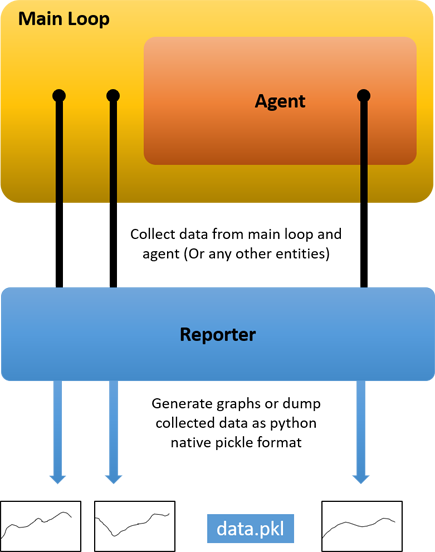
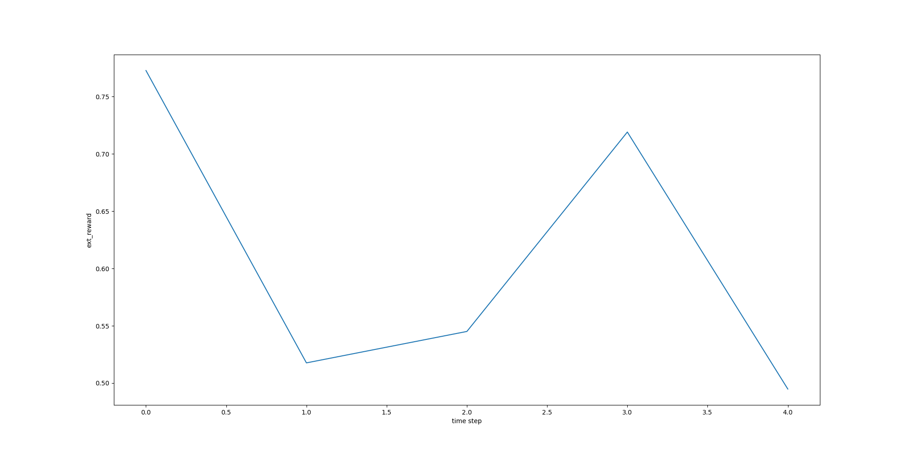
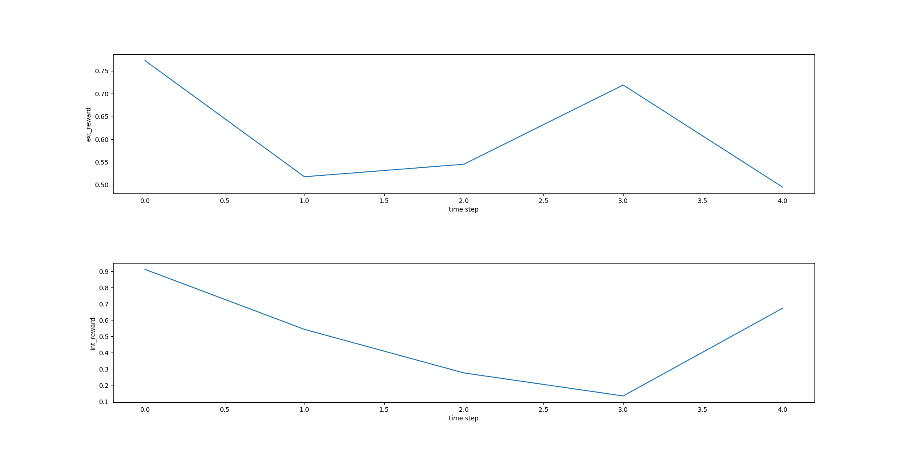
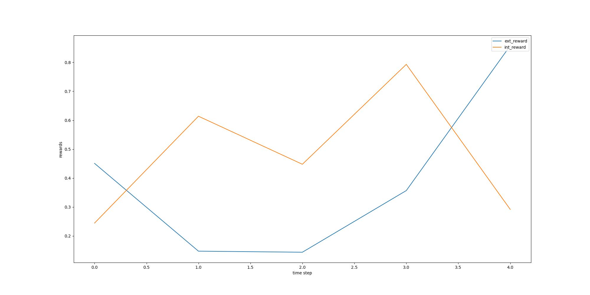
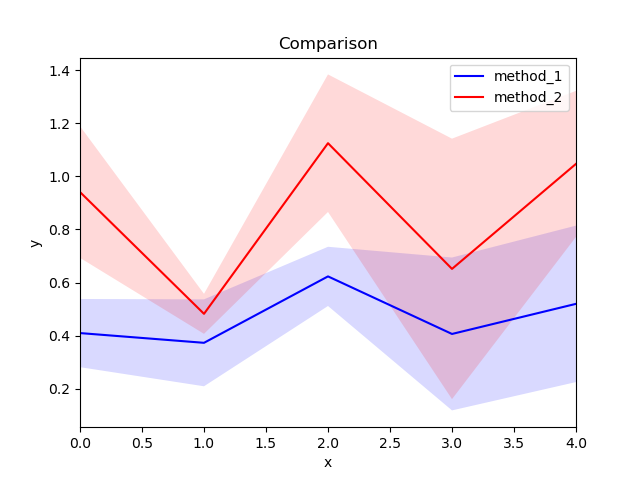

# Reporter
A python tool to collect data and generate graphs for reinforcement learning (RL) experiments

## Overview
Reporter is an external utility class that probes into client entities (eg. main loop and agent) to collect data for graph plotting or dumping purposes. For an RL experiment, it can collect external rewards, internal rewards, and any other variable of interest within entities of any level.
This separates the responsibility of data collection and graph plotting from these entities to follow the single responsibility principle. 




## Usage
### Plot a single graph on a single figure

#### Step 1: Create the result directory
```
Reporter.create_results_directory('Results')
```
#### Step 2: Setup report for variable
A one-time setup for each variable. For example, to collect external reward over some time step:
```
Reporter.setup("ext_reward", "time step", type=Reporter.Type.PLOT)
```
#### Step 3: Append data to variable
Append the variable's value on each time step 
```
Reporter.append("ext_reward", ext_reward)
```
#### Step 4: Save the figure for the variable plot
```
Reporter.save_figure("ext_reward.png", "ext_reward")
```



### Plot graphs separately on the same figure
Setup ext_reward and int_reward reports as before and collect their data. Then to plot them together on a same figure:
```
Reporter.save_figure("rewards.png", "ext_reward", "int_reward")
```


### Multiple plots on the same graph
```
Reporter.save_figure("ext_int_reward.png", [["ext_reward", "int_reward"], "time step", "rewards"])
```


### Plot mean-standard deviation comparison
``` 
method_1_results = np.array(
                    [[0.3, 0.22, 0.6, 0.8, 0.62],
                    [0.59, 0.3, 0.5, 0.3, 0.12],
                    [0.34, 0.6, 0.77, 0.12, 0.82]])

method_2_results = method_1_results + np.random.random((3, 5)) - 0.11

all_method_results = {"method_1": method_1_results, "method_2": method_2_results}

Reporter.save_plot_comparison(file="comparison.png", plots=all_method_results, title="Comparison", xlabel="x", ylabel="y")
```


